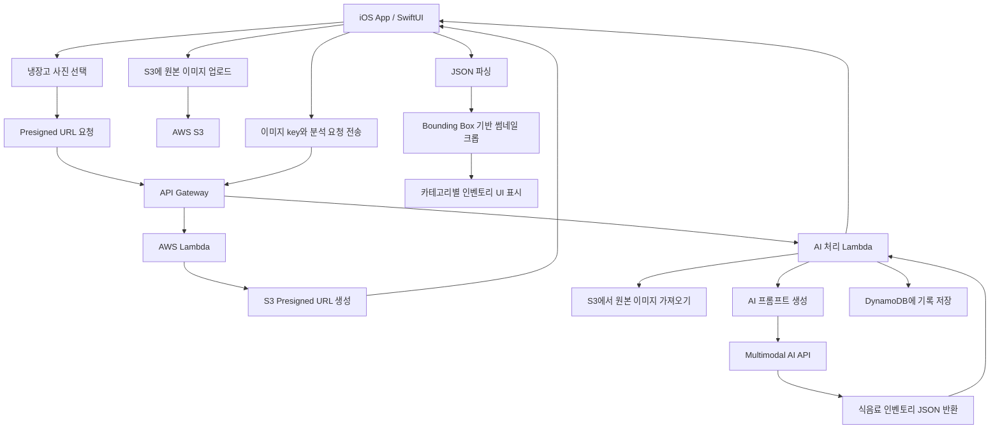

# Fridgetory -- 냉장고 속 식음료 관리용 어플리케이션

사용자가 냉장고 내부 사진을 업로드하면, AI가 이를 분석하여 식음료 목록, 유통기한, 보관 정보, 아이템 썸네일을 자동 생성하는 스마트 냉장고 인벤토리 어플리케이션의 프로토타입을 만들었습니다.


이 프로젝트는 냉장고 사진을 기반으로 식음료 정보를 자동 정리하는 iOS 앱 프로토타입입니다. 사용자가 냉장고 내부 사진을 업로드하면, 멀티모달 AI가 이미지 속 식음료를 감지하고 이름, 카테고리, 수량, 유통기한, 보관 상태, bounding box 정보를 구조화된 JSON으로 반환합니다. 앱은 이 데이터를 파싱하여 식음료 인벤토리를 생성하고, bounding box를 이용해 원본 이미지에서 각 아이템의 썸네일을 잘라 카테고리별로 표시합니다. 백엔드는 AWS API Gateway, Lambda, S3, DynamoDB를 사용하여 이미지 업로드, AI 요청 처리, 결과 저장을 담당합니다.


> **프로젝트 기간:** 2025.11.05 ~ 2025.12.08  
> **개발 인원:** 1인 개발

> **핵심 목표:**

```text
냉장고 사진 업로드
→ AI 기반 식음료 인식
→ 구조화된 인벤토리 생성
→ 카테고리별 정리
→ 유통기한 및 보관 정보 제공
→ 사용자에게 시각적인 냉장고 관리 화면 제공
```

---

## 어플리케이션 시연 영상


https://github.com/user-attachments/assets/e4ff4a9a-8b28-4c84-9790-5ccbc195038e


## 1. 서비스 개요

이 서비스는 냉장고 내부 사진을 기반으로 사용자의 식음료 정보를 자동으로 정리하는 스마트 냉장고 인벤토리 앱입니다.

기존 방식에서는 사용자가 냉장고 안의 물건을 직접 하나씩 입력해야 했지만, 이 서비스에서는 사진 한 장 또는 여러 장을 업로드하는 것만으로 냉장고 안의 식음료 정보를 자동 추출하도록 설계했습니다.

AI는 업로드된 이미지를 분석하여 다음과 같은 정보를 생성합니다.

```text
- 식음료 이름
- 카테고리
- 수량 또는 개수 추정
- 이미지 내 위치 정보
- 예상 유통기한
- 현재 상태 추정
- 보관 가이드
- 사용 권장 시점
- AI 메모
```

앱은 이 정보를 바탕으로 사용자의 냉장고를 하나의 디지털 인벤토리처럼 보여줍니다.

---

## 2. 전체 아키텍처

이 단계의 서비스는 iOS 앱, AWS 서버리스 백엔드, S3 이미지 저장소, DynamoDB, 멀티모달 AI API로 구성되었습니다.




전체 흐름은 다음과 같습니다.

```text
iOS 앱
→ S3 업로드 URL 요청
→ 원본 냉장고 사진을 S3에 업로드
→ 이미지 key를 백엔드 Lambda로 전달
→ Lambda가 이미지를 가져와 AI 모델에 전달
→ AI가 식음료 정보와 bounding box를 JSON으로 반환
→ iOS 앱이 JSON을 파싱
→ 원본 이미지에서 각 아이템 영역을 잘라 썸네일 생성
→ 인벤토리 화면에 카테고리별로 표시
```

---

## 3. 주요 구성 요소

### 3.1 iOS App

iOS 앱은 SwiftUI 기반으로 구성되었습니다.

앱의 역할은 다음과 같습니다.

```text
- 냉장고 사진 선택 및 업로드
- S3 Presigned URL 요청
- 원본 이미지 업로드
- AI 분석 요청 전송
- AI 응답 JSON 파싱
- 식음료 아이템 모델 생성
- bounding box 기반 썸네일 크롭
- 카테고리별 인벤토리 UI 표시
- 아이템 상세 정보 표시
- 사용자 수정 정보 반영
```

프론트엔드의 핵심은 단순히 AI 응답을 텍스트로 보여주는 것이 아니라, AI가 반환한 구조화 데이터를 실제 인벤토리 UI로 변환하는 것입니다.

예를 들어 AI가 “우유”, “요거트”, “양상추”, “계란”을 감지하면 앱은 이를 다음과 같이 정리합니다.

```text
Dairy
- 우유
- 요거트
- 치즈

Vegetables
- 양상추
- 당근

Protein
- 계란
```

각 아이템은 원본 냉장고 사진에서 잘라낸 썸네일 이미지와 함께 표시됩니다.

---

### 3.2 API Gateway

API Gateway는 iOS 앱과 AWS Lambda 사이의 HTTPS 진입점 역할을 합니다.

iOS 앱은 Lambda를 직접 호출하지 않고 API Gateway endpoint를 통해 요청을 보냅니다.

API Gateway의 역할은 다음과 같습니다.

```text
- 모바일 앱 요청 수신
- Lambda로 요청 전달
- HTTPS endpoint 제공
- CORS 및 요청 형식 관리
- 이미지 분석 요청과 URL 생성 요청 라우팅
```

---

### 3.3 AWS Lambda

Lambda는 백엔드의 핵심 처리 로직을 담당합니다.

이 단계에서는 Lambda가 크게 두 가지 역할을 수행했습니다.

```text
1. S3 Presigned URL 생성
2. 냉장고 이미지 분석 요청 처리
```

첫 번째 Lambda는 iOS 앱이 이미지를 S3에 직접 업로드할 수 있도록 Presigned URL을 생성합니다.

두 번째 Lambda는 이미지 분석을 담당합니다. 이 Lambda는 S3에 저장된 이미지를 가져오고, AI 모델에 전달할 프롬프트를 구성한 뒤, AI 응답을 받아 앱에 반환합니다.

---

### 3.4 S3

S3는 사용자가 업로드한 원본 냉장고 사진을 저장하는 역할을 합니다.

처음에는 이미지를 base64로 변환하여 API 요청에 직접 포함하는 방식도 고려했지만, 데이터 크기가 커져 API Gateway나 Lambda의 용량 제한에 걸릴 수 있었습니다.

따라서 이 서비스는 다음과 같은 구조를 사용했습니다.

```text
iOS 앱
→ S3 Presigned URL 요청
→ iOS 앱이 원본 이미지를 S3에 직접 업로드
→ Lambda에는 이미지 파일 자체가 아니라 S3 image key만 전달
```

예시 요청은 다음과 같습니다.

```json
{
  "sessionId": "user-session-id",
  "message": "냉장고 안의 식음료를 정리해줘",
  "imageKeys": [
    "uploads/fridge-photo-001.jpg"
  ]
}
```

이 구조의 장점은 다음과 같습니다.

```text
- 큰 이미지 파일을 API Gateway로 직접 보내지 않아도 됨
- 원본 이미지 품질 유지 가능
- Lambda 요청 크기 제한 회피
- 여러 장의 사진 처리에 유리
- 백엔드가 image key만으로 이미지를 다시 불러올 수 있음
```

---

### 3.5 DynamoDB

DynamoDB는 사용자 세션, 대화 기록, AI 분석 결과 등을 저장하는 용도로 사용되었습니다.

저장되는 데이터의 예시는 다음과 같습니다.

```json
{
  "sessionId": "user-session-id",
  "timestamp": 1764800000000,
  "role": "user",
  "content": "냉장고 안의 식음료를 정리해줘",
  "imageKeys": [
    "uploads/fridge-photo-001.jpg"
  ]
}
```

AI 응답도 함께 저장될 수 있습니다.

```json
{
  "sessionId": "user-session-id",
  "timestamp": 1764800000001,
  "role": "assistant",
  "content": "냉장고 식음료 인벤토리를 생성했습니다.",
  "inventoryItemCount": 18
}
```

DynamoDB를 사용한 이유는 다음과 같습니다.

```text
- 세션별 대화 기록 저장
- 이전 인벤토리 상태 조회
- 후속 질문에 대한 문맥 유지
- AI 분석 결과 추적
- 서버리스 환경과의 쉬운 연동
```

---

## 4. 서비스 작동 메커니즘

이 서비스의 전체 작동 과정은 다음과 같습니다.

### Step 1. 사용자가 냉장고 사진을 업로드

사용자는 앱에서 냉장고 내부 사진을 선택하거나 촬영합니다.

사진은 한 장일 수도 있고 여러 장일 수도 있습니다.

예를 들어 다음과 같이 여러 구역을 나누어 촬영할 수 있습니다.

```text
- 냉장고 상단 선반
- 냉장고 하단 선반
- 냉장고 문 쪽 수납공간
- 냉동실 또는 별도 칸
```

---

### Step 2. 앱이 Presigned URL을 요청

앱은 이미지를 바로 서버로 보내지 않고, 먼저 백엔드에 S3 업로드용 Presigned URL을 요청합니다.

```text
iOS App → API Gateway → Lambda → S3 Presigned URL 생성
```

Lambda는 제한된 시간 동안만 사용할 수 있는 업로드 URL을 생성해 앱에 반환합니다.

---

### Step 3. 앱이 원본 이미지를 S3에 업로드

iOS 앱은 받은 Presigned URL을 사용하여 원본 냉장고 이미지를 S3에 직접 업로드합니다.

이후 앱은 이미지 파일 자체가 아니라 S3에 저장된 이미지의 key를 백엔드에 전달합니다.

```text
이미지 파일: S3에 저장
백엔드 요청: imageKey만 전달
```

---

### Step 4. 앱이 AI 분석 요청을 보냄

이미지 업로드가 완료되면 앱은 다음 정보를 백엔드로 보냅니다.

```text
- sessionId
- 사용자 메시지
- S3 image key 목록
- 현재 인벤토리 상태
- 이전 대화 맥락
```

예시 요청은 다음과 같습니다.

```json
{
  "sessionId": "session-123",
  "message": "이 냉장고 사진을 분석해서 식음료를 정리해줘",
  "imageKeys": [
    "uploads/fridge-upper.jpg",
    "uploads/fridge-door.jpg"
  ]
}
```

---

### Step 5. Lambda가 이미지를 가져오고 AI 프롬프트를 구성

Lambda는 전달받은 image key를 사용하여 S3에서 원본 이미지를 가져옵니다.

그다음 AI 모델에 전달할 프롬프트를 구성합니다.

프롬프트에는 다음과 같은 지시가 포함됩니다.

```text
- 냉장고 사진 속 모든 식음료를 감지할 것
- 각 아이템의 이름을 추정할 것
- 카테고리별로 분류할 것
- 수량을 추정할 것
- 유통기한 또는 사용 권장 시점을 추정할 것
- 보관 상태를 설명할 것
- 각 아이템의 이미지 내 위치를 bounding box로 반환할 것
- 결과는 JSON 형식으로 반환할 것
- JSON은 <INVENTORY> 태그 안에 넣어 반환할 것
```

---

### Step 6. 멀티모달 AI가 냉장고 이미지를 분석

AI 모델은 이미지와 프롬프트를 함께 입력받습니다.

이 단계에서 AI는 다음 작업을 수행합니다.

```text
1. 냉장고 사진에서 식음료 영역 감지
2. 각 아이템의 종류 추정
3. 카테고리 분류
4. 수량 추정
5. 포장 상태 또는 신선도 추정
6. 유통기한 추정
7. 보관 방법 제안
8. bounding box 좌표 생성
9. 구조화된 JSON 생성
```

이 서비스의 핵심은 AI가 단순한 자연어 설명이 아니라, 앱이 바로 사용할 수 있는 구조화된 데이터를 반환하도록 설계했다는 점입니다.

---

## 5. AI 응답 구조

AI는 다음과 같은 형식으로 결과를 반환하도록 설계되었습니다.

```text
<INVENTORY>
{
  "categories": {
    "Dairy": [
      {
        "id": "item-001",
        "name": "Milk",
        "category": "Dairy",
        "quantity": "1 carton",
        "bbox": {
          "ymin": 0.18,
          "xmin": 0.24,
          "ymax": 0.52,
          "xmax": 0.46
        },
        "sourceImageIndex": 0,
        "pictureTakenAt": "2025-12-04T00:00:00.000Z",
        "expirationDate": "2025-12-10T00:00:00.000Z",
        "purchaseDate": "",
        "conditionWhenPhotographed": "sealed and fresh",
        "estimatedConditionNow": "fresh",
        "daysUntilExpiration": 6,
        "storageGuidance": "Keep refrigerated and consume soon after opening.",
        "aiNotes": "Use within 6 days.",
        "userNotes": ""
      }
    ]
  }
}
</INVENTORY>
```

이 구조에서 가장 중요한 필드는 다음과 같습니다.

```text
name:
  식음료 이름

category:
  식음료 카테고리

quantity:
  수량 또는 개수 추정

bbox:
  원본 이미지 안에서 해당 아이템이 위치한 영역

sourceImageIndex:
  여러 장의 이미지 중 어느 이미지에서 감지되었는지 표시

expirationDate:
  예상 유통기한

daysUntilExpiration:
  남은 일수

storageGuidance:
  보관 방법

aiNotes:
  AI가 제공하는 주의사항 또는 메모

userNotes:
  사용자가 직접 수정하거나 추가할 수 있는 메모
```

---

## 6. Bounding Box 기반 썸네일 생성

AI는 각 아이템의 위치를 `bbox`로 반환합니다.

`bbox`는 0부터 1 사이의 정규화된 좌표로 구성됩니다.

```json
{
  "ymin": 0.18,
  "xmin": 0.24,
  "ymax": 0.52,
  "xmax": 0.46
}
```

iOS 앱은 이 좌표를 원본 이미지의 실제 픽셀 크기로 변환합니다.

```text
x = xmin × imageWidth
y = ymin × imageHeight
width = (xmax - xmin) × imageWidth
height = (ymax - ymin) × imageHeight
```

그 후 해당 영역을 원본 이미지에서 잘라내어 개별 아이템 썸네일로 사용합니다.

이 방식의 장점은 다음과 같습니다.

```text
- AI가 감지한 식음료를 시각적으로 보여줄 수 있음
- 별도의 이미지 편집 서버가 필요 없음
- 원본 이미지를 기준으로 iOS에서 빠르게 크롭 가능
- 사용자에게 실제 냉장고 속 물건과 연결된 UI 제공 가능
```

즉, AI가 단순히 “우유가 있습니다”라고 말하는 것이 아니라, 사진 속 우유 위치를 알려주고 앱이 그 부분을 잘라 실제 아이템 이미지로 보여주는 구조입니다.

---

## 7. 카테고리별 인벤토리 UI

AI 분석 결과는 앱 내부의 `FoodInventory`, `FoodItem`과 같은 데이터 모델로 변환됩니다.

그 후 앱은 각 식음료를 카테고리별로 정리하여 보여줍니다.

예시는 다음과 같습니다.

```text
Dairy
- Milk
- Yogurt
- Cheese

Vegetables
- Lettuce
- Spinach
- Carrot

Fruits
- Apple
- Orange

Condiments
- Ketchup
- Soy Sauce
```

각 카테고리는 카드 또는 섹션 형태로 표시됩니다.

아이템은 썸네일 이미지와 함께 표시되며, 사용자가 아이템을 누르면 상세 정보 화면이 열립니다.

상세 화면에는 다음 정보가 표시됩니다.

```text
- 아이템 썸네일
- 이름
- 카테고리
- 수량
- 예상 유통기한
- 남은 일수
- 현재 상태
- 보관 방법
- AI 메모
- 사용자 메모
```

---

## 8. 유통기한 및 상태 추정 로직

AI는 냉장고 사진만으로 모든 유통기한을 정확히 알 수는 없습니다.

따라서 이 서비스는 다음과 같은 우선순위로 정보를 추정하도록 설계되었습니다.

```text
1. 포장지에 유통기한이 보이면 해당 날짜를 우선 사용
2. 날짜가 보이지 않으면 식품 종류별 일반적인 보관 기간을 기준으로 추정
3. 개봉 여부, 포장 상태, 신선도 등을 함께 고려
4. 불확실한 경우 AI 메모에 추정임을 표시
```

앱은 유통기한 정보를 바탕으로 아이템을 다음과 같이 분류할 수 있습니다.

```text
Urgent:
  1~2일 이내 사용 권장

Use Soon:
  3~7일 이내 사용 권장

Normal:
  아직 여유 있음

Unknown:
  유통기한을 확정하기 어려움
```

예시는 다음과 같습니다.

```text
Urgent
- Leftover pasta: 1 day left
- Spinach: 2 days left

Use Soon
- Milk: 5 days left
- Yogurt: 6 days left
```

이 기능은 사용자가 냉장고 속 음식을 더 빨리 소비하고 음식물 쓰레기를 줄일 수 있도록 돕기 위한 것입니다.

---

## 9. 여러 장의 냉장고 사진 처리

냉장고 전체를 한 장의 사진으로 담기 어려운 경우가 많기 때문에, 여러 장의 이미지를 하나의 분석 요청으로 처리하는 구조도 고려되었습니다.

예를 들어 사용자가 다음과 같이 사진을 업로드할 수 있습니다.

```text
image 0: 냉장고 상단
image 1: 냉장고 하단
image 2: 냉장고 문 쪽 수납공간
```

AI는 여러 이미지를 한 번에 분석하고, 각 아이템에 `sourceImageIndex`를 포함하여 반환합니다.

```json
{
  "name": "Yogurt",
  "category": "Dairy",
  "sourceImageIndex": 1,
  "bbox": {
    "ymin": 0.40,
    "xmin": 0.20,
    "ymax": 0.62,
    "xmax": 0.48
  }
}
```

iOS 앱은 `sourceImageIndex`를 보고 어떤 원본 이미지에서 해당 아이템을 잘라야 하는지 판단합니다.

```text
sourceImageIndex = 1
→ 두 번째 원본 이미지 사용
→ bbox 좌표에 따라 이미지 크롭
→ Yogurt 아이템 썸네일로 저장
```

이 구조를 사용하면 여러 장의 사진을 하나의 통합 인벤토리로 정리할 수 있습니다.

---

## 10. One-Shot AI 분석 방식

초기에는 두 단계 분석 방식도 고려할 수 있었습니다.

```text
1단계:
  전체 냉장고 사진에서 식음료와 위치를 감지

2단계:
  잘라낸 각 아이템 이미지를 다시 AI에 보내 더 정확히 분류
```

하지만 이 방식은 아이템 수가 많아질수록 AI 호출 횟수가 급격히 증가합니다.

예를 들어 냉장고 안에서 30개의 아이템이 감지되면, 2단계 분석 방식에서는 추가로 여러 번의 AI 호출이 필요할 수 있습니다.

```text
냉장고 사진 1장
→ 전체 분석 1회
→ 개별 아이템 재분석 10~30회
→ 처리 시간 증가
→ 비용 증가
→ 사용자 대기 시간 증가
```

따라서 MVP 단계에서는 One-Shot 분석 방식을 사용했습니다.

```text
한 번의 AI 요청으로:
- 식음료 감지
- 카테고리 분류
- 수량 추정
- 유통기한 추정
- 상태 설명
- bounding box 생성
- JSON 인벤토리 생성
```

One-Shot 방식의 장점은 다음과 같습니다.

```text
- 처리 속도가 빠름
- AI API 비용 절감
- 모바일 앱 UX에 적합
- 구조가 단순함
- MVP 구현에 적합
```

단점은 개별 아이템을 다시 확대 분석하지 않기 때문에 일부 식품의 정확한 브랜드명이나 세부 종류를 틀릴 수 있다는 점입니다.

이를 보완하기 위해 사용자가 아이템 이름, 카테고리, 메모 등을 직접 수정할 수 있도록 설계했습니다.

---

## 11. 사용자 수정 메커니즘

AI가 항상 완벽하게 식음료를 인식하는 것은 아니기 때문에, 사용자가 결과를 수정할 수 있는 구조를 포함했습니다.

예를 들어 AI가 어떤 아이템을 다음과 같이 인식할 수 있습니다.

```text
Green vegetable
```

사용자는 이를 다음과 같이 수정할 수 있습니다.

```text
Spinach
```

또는 AI가 다음처럼 인식한 경우:

```text
Sauce bottle
```

사용자가 직접 다음처럼 바꿀 수 있습니다.

```text
Soy sauce
```

사용자 수정값은 앱의 인벤토리 상태에 반영됩니다.

이후 AI에게 다시 질문하거나 인벤토리를 업데이트할 때, 수정된 정보가 더 신뢰도 높은 데이터로 사용될 수 있습니다.

---

## 12. 핵심 AI 프롬프트 설계

이 서비스의 AI 로직은 프롬프트 설계가 매우 중요했습니다.

AI에게 단순히 “사진을 설명해줘”라고 요청하면 앱에서 사용하기 어려운 자연어 응답이 나올 수 있습니다.

따라서 AI에게 다음과 같이 명확한 역할과 출력 형식을 부여했습니다.

```text
You are a smart refrigerator inventory assistant.

Analyze the uploaded refrigerator images.
Detect all visible food and beverage items.
Group them into categories.
Estimate quantity, freshness, expiration, and storage guidance.
Return the result as valid JSON only inside <INVENTORY> tags.
Each item must include a normalized bounding box.
```

이 프롬프트 설계의 목적은 다음과 같습니다.

```text
- AI 응답을 앱에서 안정적으로 파싱하기 위함
- 자연어 설명이 아닌 구조화 데이터를 얻기 위함
- UI에 바로 연결 가능한 inventory object를 생성하기 위함
- 이미지 속 위치 정보를 bounding box로 받기 위함
- 추후 사용자 수정 및 저장이 가능한 데이터 모델로 변환하기 위함
```

---

## 13. 데이터 변환 흐름

AI 응답은 앱에서 다음과 같은 순서로 처리됩니다.

```text
AI 응답 문자열
→ <INVENTORY> 태그 내부 추출
→ JSON 파싱
→ FoodInventory 모델로 변환
→ FoodItem 배열 생성
→ 각 FoodItem의 bbox 확인
→ sourceImageIndex에 해당하는 원본 이미지 선택
→ bbox 좌표를 픽셀 좌표로 변환
→ 원본 이미지에서 해당 영역 크롭
→ 크롭 이미지를 item thumbnail로 연결
→ InventoryView에 표시
```

즉, AI는 인식과 구조화 역할을 담당하고, iOS 앱은 그 결과를 실제 사용자 인터페이스로 변환하는 역할을 담당합니다.

---

## 14. 보안 및 설계상 장점

이 구조에서 중요한 점은 AI API Key나 AWS Secret을 iOS 앱 내부에 직접 넣지 않았다는 점입니다.

모바일 앱 안에 API Key를 넣으면 앱이 배포된 뒤 reverse engineering을 통해 키가 노출될 수 있습니다.

따라서 이 서비스는 다음 구조를 사용했습니다.

```text
iOS App
→ API Gateway
→ Lambda
→ AI API
```

AI API Key는 Lambda의 환경 변수 또는 서버 측 설정에 저장하고, iOS 앱은 직접 AI API를 호출하지 않습니다.

이 구조의 장점은 다음과 같습니다.

```text
- AI API Key 보호
- AWS credential 보호
- 요청 로깅 및 사용량 추적 가능
- AI 요청 형식 통제 가능
- 비용 및 남용 방지 가능
- 클라이언트 업데이트 없이 서버 로직 수정 가능
```

---

## 15. 전체 작동 과정 요약

전체 메커니즘을 간단히 정리하면 다음과 같습니다.

```text
1. 사용자가 냉장고 사진을 촬영하거나 선택한다.
2. iOS 앱이 백엔드에 S3 Presigned URL을 요청한다.
3. Lambda가 업로드 URL을 생성해 앱에 반환한다.
4. iOS 앱이 원본 이미지를 S3에 업로드한다.
5. 앱이 업로드된 이미지 key와 사용자 요청을 Lambda로 보낸다.
6. Lambda가 S3에서 이미지를 가져온다.
7. Lambda가 냉장고 인벤토리 분석용 AI 프롬프트를 생성한다.
8. 멀티모달 AI가 이미지를 분석한다.
9. AI가 식음료 이름, 카테고리, 수량, 유통기한, 상태, bounding box를 JSON으로 반환한다.
10. Lambda가 AI 응답을 앱으로 전달하고 필요한 경우 DynamoDB에 저장한다.
11. iOS 앱이 <INVENTORY> 태그 내부의 JSON을 추출한다.
12. 앱이 JSON을 FoodInventory와 FoodItem 모델로 변환한다.
13. 각 FoodItem의 bounding box를 이용해 원본 이미지에서 썸네일을 자른다.
14. 앱이 식음료를 카테고리별로 정리해 Inventory 화면에 표시한다.
15. 사용자는 아이템 상세 정보를 확인하거나 잘못된 정보를 수정할 수 있다.
```

---

## 16. 프로젝트의 핵심 특징

이 서비스의 핵심 특징은 다음과 같습니다.

```text
- 냉장고 사진 기반 자동 식음료 인식
- 멀티모달 AI를 이용한 이미지 분석
- 구조화된 JSON 기반 인벤토리 생성
- bounding box를 이용한 아이템별 썸네일 생성
- S3 Presigned URL 기반 이미지 업로드
- Lambda 기반 서버리스 AI 처리
- DynamoDB 기반 세션 및 분석 기록 저장
- 카테고리별 식음료 관리 UI
- 유통기한 및 보관 상태 추정
- 사용자 수정 가능한 인벤토리 구조
```

---

## 17. 기술 스택

```text
Frontend:
- SwiftUI
- iOS Photos / Camera
- Local data models
- Image cropping logic

Backend:
- AWS API Gateway
- AWS Lambda
- AWS S3
- AWS DynamoDB

AI:
- Multimodal AI API
- Image understanding
- Structured JSON generation
- Bounding box detection

Data:
- JSON
- FoodInventory model
- FoodItem model
```

---
